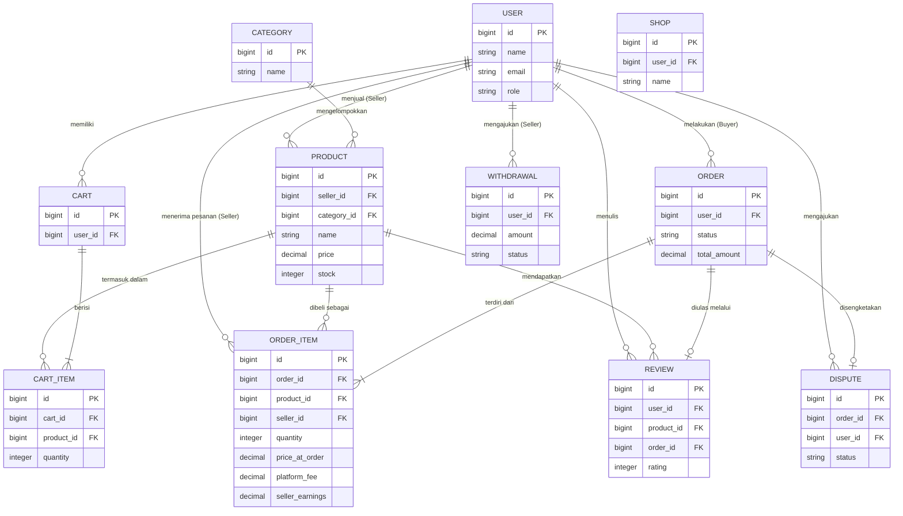

<div align="center">
  
  
  # 🛒 SimpleShop — E-Commerce Platform

  **Platform E-Commerce Multi-Seller yang Ringan & Modern** dibangun dengan arsitektur TALL stack (Tailwind CSS, Alpine.js, Laravel) dan terintegrasi secara penuh dengan ekosistem Filament PHP untuk kemudahan manajemen administratif.
  
  [](https://laravel.com)
  [](https://php.net)
  [](https://tailwindcss.com)
  [](https://alpinejs.dev)
</div>

---

## 👥 Anggota Kelompok 3

1. **Rahmi Mariati**
2. **Farhan Alfarisi**
3. **Ulun Nuha Mafri**
4. **Muhamad Adzky Maulana**
5. **Maula Rizkan**

---

## 📖 Deskripsi Komprehensif Platform

**SimpleShop** adalah solusi platform e-commerce yang dirancang secara spesifik dan terstruktur untuk mendukung ekosistem **Multi-Seller Marketplace** (Pusat Perbelanjaan Multi-Penjual). Melalui arsitektur sistem ini, pendaftaran pengguna difasilitasi ke dalam berbagai klasifikasi peran utama:
- **Buyer (Pembeli):** Peran yang difokuskan pada penelusuran katalog, pengelolaan keranjang belanja, hingga penyelesaian transaksi pembelian produk.
- **Seller (Penjual):** Peran bagi pengguna yang mendaftarkan entitas toko secara mandiri untuk mengelola inventaris produk, memproses pesanan masuk, serta mengelola pencairan dana hasil penjualan.
- **Admin:** Peran administratif dengan otoritas penuh untuk memantau keberjalanan platform, memodifikasi pengaturan sistem dasar, serta melakukan intervensi jika terdapat sengketa transaksi.

Platform ini telah berevolusi dengan serangkaian pembaruan fungsionalitas tingkat lanjut. Di antaranya adalah sistem manajemen produk yang mendetail (termasuk penerapan diskon khusus dan regulasi *Cash on Delivery*), keranjang belanja asinkronus berbasis integrasi AJAX, mekanisme penyelesaian transaksi (checkout) yang divalidasi oleh sistem keamanan *Pessimistic Locking* guna mencegah duplikasi pengurang stok pada waktu bersamaan, hingga integrasi dompet digital internal (*wallet*) untuk simplifikasi perputaran dana di dalam ekosistem.

---

## 🥞 Arsitektur TALL Stack

Aplikasi ini dikembangkan di atas fondasi **TALL Stack**, sebuah ekosistem pengembangan web modern yang menawarkan keseimbangan sempurna antara produktivitas *developer*, performa sistem, dan pengalaman antarmuka (*User Experience*) yang sangat interaktif. TALL adalah akronim dari:

- **[T]ailwind CSS**: Kerangka kerja (*framework*) *utility-first CSS* yang digunakan untuk merancang tata letak dan desain antarmuka secara kustom, responsif, elegan, dan konsisten secara langsung tanpa penulisan berkas CSS terpisah yang membengkak.
- **[A]lpine.js**: Pustaka JavaScript ringan dan tangguh yang menyuntikkan interaktivitas (*reactivity*) pada sisi klien (*client-side*). Alpine dipercaya mengatur komponen antarmuka *front-end* dinamis seperti *dropdown modal*, penutupan notifikasi mandiri, hingga manipulasi antarmuka keranjang belanja asinkronus (*AJAX integration*) tanpa *overhead* dari pustaka JavaScript berukuran besar.
- **[L]aravel**: Bertindak sebagai mesin tulang punggung infrastruktur (*Backend*). Kerangka kerja PHP kelas *enterprise* ini menangani orkestrasi seluruh logika bisnis, relasi *database* yang rumit, proteksi keamanan tingkat tinggi (*Pessimistic Locking* & otentikasi lapis ganda), hingga manajemen rutinitas asinkronus latar belakang (*Queue Workers*).
- **[L]ivewire**: *Framework full-stack* inovatif di ekosistem Laravel. Pada aplikasi ini, kekuatan super **Livewire** dimanfaatkan secara masif melalui integrasi [Filament PHP](https://filamentphp.com). Teknologi inilah yang memungkinkan keseluruhan interaksi di dalam Dasbor Administratif (*Seller/Admin Console*) berjalan reaktif, cepat, dan mulus layaknya *Single Page Application* (SPA) tanpa perlu penulisan API sisi *client* yang rumit.

Sinergi teknologi arsitektural ini memastikan pengalaman pengguna di ujung layar (*end-user*) berjalan begitu cepat dan mulus, sembari mempertahankan integritas keamanan serta stabilitas kode tingkat lanjut di belakang layar.

---

## ✨ Rincian Fungsionalitas Utama

### 🛍️ Modul Evaluasi dan Transaksi Pembeli (Buyer)
- **Katalog Terbuka & Pencarian Dinamis (Live Search):** Fasilitas pencarian produk yang terintegrasi dengan metode penyaringan berbasis kategori. Proses pencarian beroperasi secara *real-time* memanfaatkan antarmuka API (berbasis AJAX), yang memungkinkan pembaruan hasil pencarian secara seketika tanpa memerlukan pemuatan ulang (*reload*) pada halaman utama.
- **Manajemen Profil & Personalisasi Avatar:** Dukungan teknis bagi entitas pengguna untuk memperbarui informasi personal serta mengunggah atau mengganti foto profil (avatar) yang disimpan menggunakan sistem penamaan berkas berbasis *timestamp* secara aman.
- **Analitik Popularitas Produk (View Tracking):** Mekanisme penghitungan otomatis yang mencatat setiap kunjungan (tayangan) pada halaman detail produk. Kalkulasi metrik ini diimplementasikan untuk mendongkrak visibilitas produk yang masuk ke dalam kategori tren utama (*Trending Products*).
- **Keranjang Belanja Pintar & Multi-Penjual (Smart Cart via AJAX):** Antarmuka asinkronus untuk operasi penambahan, pengurangan kuantitas, maupun penghapusan entitas produk dari keranjang belanja. Sistem ini kini mendayagunakan kapabilitas **Multi-Seller Cart**, memungkinkan pembeli untuk mencampur ragam produk dari berbagai penjual yang berbeda dalam satu kali sesi keranjang secara bersamaan tanpa batasan.
- **Algoritma Checkout & Pemisahan Pesanan Otomatis:** Memfasilitasi fleksibilitas pembayaran (Transfer Bank, Saldo Wallet, hingga COD). Algoritma checkout secara otomatis akan **memecah (*split order*)** satu keranjang multi-penjual menjadi beberapa catatan pesanan terpisah berdasarkan identitas masing-masing penjual. Di samping itu, khusus untuk metode pembayaran *Cash on Delivery* (COD), algoritma akan secara selektif memfilter dan hanya memproses produk-produk yang mengizinkan dukungan COD.
- **Pelacakan dan Manajemen Pesanan Terpusat:** Dasbor antarmuka pembeli yang menyajikan histori transaksi lengkap, pemantauan status proses pesanan secara waktu nyata, hingga kemampuan pembatalan proaktif yang diizinkan selama pesanan tersebut masih berstatus *Pending*.
- **Fasilitas Ulasan dan Penilaian (Product Reviews):** Modul interaktif pasca-transaksi yang memungkinkan pembeli untuk memberikan penilaian kuantitatif (skor bintang) serta ulasan kualitatif pada produk, setelah pesanan dinyatakan selesai secara sistem.
- **Notifikasi Terintegrasi Dalam Aplikasi (In-App Notifications):** Sistem pemberitahuan *push* pada antarmuka pengguna yang segera menyajikan informasi kritis seperti transisi status pesanan, tanpa mengharuskan pengguna untuk memeriksa kotak masuk surel.
- **Resolusi Sengketa (Dispute Mechanism):** Fasilitas formal bagi pihak pembeli untuk mengajukan eskalasi keluhan apabila terdapat indikasi ketidaksesuaian barang, kerusakan, atau kegagalan pengiriman pada pesanan yang sudah tercatat.

### 🏬 Modul Operasional Penjual (Seller) & Administratif
- **Konsol Administratif & Analitik Terpusat (Stitch Dashboard):** Implementasi dasbor administratif tingkat lanjut (*Admin Console*) yang ditenagai oleh Filament. Fasilitas ini menyediakan analitik komprehensif yang mencakup pelacakan metrik *Gross Merchandise Value* (GMV), tren peningkatan penjual aktif dan pelanggan baru, serta kalkulasi akumulasi biaya platform (*Platform Fee*). Dilengkapi dengan visualisasi data melalui grafik *Donut Chart* untuk status pesanan dan grafik garis (*Line Chart*) untuk riwayat tren penjualan (mingguan, bulanan, tahunan).
- **Manajemen Inventaris Lanjutan (CRUD Produk):** Formulasi pengelolaan katalog produk yang mendalam. Penjual diizinkan untuk mengonfigurasi visibilitas produk, mengunggah dokumentasi visual (gambar), menetapkan nominal harga beserta persentase **Diskon** spesifik, hingga menonaktifkan atau mengaktifkan ketersediaan metode pengiriman **COD** pada masing-masing item produk.
- **Tahapan Pemrosesan & Pencairan Dana Otomatis (Escrow-like Order Flow):** Kemudahan operasional bagi penjual untuk melakukan transisi status pesanan dari pihak pembeli melalui empat fase validasi: `Pending` (Menunggu Pembayaran) ➔ `Paid` (Pembayaran Terverifikasi) ➔ `Shipped` (Barang dalam Pengiriman) ➔ `Completed` (Pesanan Selesai). Pada sistem ini, pembayaran dari pembeli akan ditampung terlebih dahulu oleh Platform. Saat pesanan beralih ke status `Completed`, sistem secara otomatis akan mencairkan dan meneruskan dana penjualan ke saldo dompet (wallet) penjual terkait.
- **Sistem Pemotongan Komisi Berbasis Transaksi (Commission System):** Mekanisme algoritmik yang bekerja selaras dengan proses penyelesaian pesanan di atas. Sistem secara otomatis melakukan ekstraksi persentase komisi bagi pihak platform secara *real-time* tepat sebelum dana diteruskan ke dompet penjual, memastikan keberlanjutan operasional aplikasi.
- **Antarmuka Tabel Dinamis & Pengurutan Cerdas (Smart Data Sorting):** Menyajikan data operasional melalui tabel interaktif yang mendukung pengurutan (*sorting*) multi-kolom secara presisi (berdasarkan tanggal, harga, maupun stok). Pengalaman antarmuka (UI/UX) telah diselaraskan pada seluruh panel Seller dan Admin guna menampilkan indikator pengurutan yang sangat bersih dan rapi.
- **Pengaturan Modul Platform Dinamis (Platform Settings):** Sebuah ruang kontrol eksklusif bagi pemegang hak administratif untuk menyesuaikan konfigurasi global platform (seperti modifikasi besaran persentase komisi hingga pembaruan informasi rekening bank operasional utama platform) secara dinamis tanpa intervensi langsung pada kode sumber (_source code_). Fitur ini telah dilengkapi validasi cerdas untuk memverifikasi kesesuaian panjang karakter nomor rekening terhadap bank yang dipilih dan desain *form* yang dioptimalkan secara visual.
- **Mekanisme Pencairan Dana (Withdrawal):** Sistem penarikan saldo terstruktur bagi entitas penjual untuk mencairkan saldo dompet internal yang terakumulasi dari hasil penjualan produk ke rekening perbankan eksternal. Dasbor juga memungkinkan admin untuk memantau pengajuan penarikan dana terkini.
- **Distribusi Notifikasi Otomatis (Email Automation):** Pengiriman pesan elektronik (email) yang dikendalikan oleh sistem latar belakang (berbasis antrean atau *queue worker*) guna memberi informasi terkait pembaruan transisi status pesanan secara instan kepada pihak terkait.
- **Ekstraksi Data Transaksional Multi-Format (Export to Excel/CSV/HTML):** Fungsi khusus untuk mendukung rekapitulasi pembukuan dan audit finansial yang memungkinkan laporan data metrik dasbor serta riwayat penjualan diunduh secara komprehensif ke dalam berbagai format *spreadsheet* yang dirender sempurna melalui pustaka `Maatwebsite/Excel`.

### ⚙️ Infrastruktur Sistem & Protokol Keamanan
- **Role-Based Access Control (RBAC):** Modul otorisasi berlapis dan pengelolaan kontrol akses yang ditenagai oleh paket *spatie/laravel-permission*. Protokol ini memberikan kepastian bahwa batas akses data dan fungsionalitas antara peran *Buyer*, *Seller*, serta *Admin* terisolasi secara aman.
- **Validasi Mutasi Data via Pessimistic Locking:** Pendekatan sistem basis data (tingkat relasional) yang secara aktif mengunci (*lock*) baris data produk pada saat terjadi pembacaan pada proses *checkout*. Protokol keamanan ini dihadirkan untuk mengeleminasi insiden *race-condition* (misal: dua transaksi melakukan finalisasi pemesanan pada barang dengan sisa stok 1 secara tepat bersamaan).
- **Proses Komputasi Asinkronus (Asynchronous Queues):** Pendelegasian rutinitas berintensitas tinggi, seperti inisiasi pengiriman email transaksional serta proses komputasi notifikasi massal, menuju instrumen latar belakang (*background job*). Hal ini memastikan halaman tidak mengalami proses *loading* yang berkepanjangan pada sisi pengguna.
- **Arsitektur Dompet Terdistribusi (Wallet System):** Modul pendataan fluktuasi keuangan (*ledger*) yang sangat akurat, menggunakan teknologi implementasi *bavix/laravel-wallet*. Seluruh mutasi dana atas pembayaran pesanan, pemotongan komisi, hingga permohonan pencairan terjamin validitasnya.
- **Perlindungan Sesi dan Rute Sensitif (Method Protection):** Penegakan aturan keamanan mutlak (termasuk perlindungan CSRF) pada *endpoint* krusial seperti proses Autentikasi Keluar (*Logout*), yang secara ketat hanya dapat dieksekusi melalui metode HTTP POST guna memitigasi kerentanan eksekusi rute yang tidak disengaja oleh *prefetch* peramban.

---

## 🚀 Panduan Instalasi dan Konfigurasi Lokal

Ikuti serangkaian instruksi instalasi di bawah ini untuk mengonfigurasi dan mereplikasi lingkungan operasional aplikasi pada infrastruktur lokal spesifikasi pengembangan (*development environment*).

> [!IMPORTANT]  
> **Prasyarat Sistem Dasar:** Pastikan ketersediaan perangkat lunak standar yang mencakup **PHP >= 8.3**, dependensi manajemen paket **Composer**, pengeksekusi sisi klien **Node.js >= 18**, serta sistem manajemen basis data relasional seperti **SQLite** atau **MySQL/MariaDB**.

```bash
# 1. Kloning repositori kode sumber ke dalam infrastruktur lokal
git clone <repository-url>
cd Simple-E-Commerce-Platform

# 2. Pengunduhan keseluruhan dependensi utilitas lapisan Backend maupun Frontend
composer install
npm install

# 3. Penetapan formulasi kredensial lingkungan aplikasi (.env)
cp .env.example .env
php artisan key:generate

# 4. Inisiasi struktur tabel basis data beserta injeksi data uji awal (Seeder)
php artisan migrate --seed

# 5. Pembuatan tautan simbolik direktori sistem berkas (Wajib untuk visualisasi gambar/avatar)
php artisan storage:link

# 6. Kompilasi modul antarmuka komponen CSS/JS (Vite & Tailwind)
npm run build
```

> [!NOTE]  
> **Menjalankan Instansi Aplikasi Terintegrasi**  
> Infrastruktur *TALL Stack* pada proyek ini merekomendasikan layanan berganda yang direpresentasikan melalui inisiasi terminal secara jamak. Bukalah tiga jendela terminal pada lingkungan kerja yang digunakan:
> - Terminal 1: `php artisan serve` (Inisiasi server HTTP utama PHP)
> - Terminal 2: `npm run dev` (Inisiasi *Hot Module Replacement* oleh Vite)
> - Terminal 3: `php artisan queue:work` (Inisiasi penanganan antrean pekerja asinkronus latar belakang)
> 
> Atau, sebagai alternatif praktis (dengan dukungan *concurrently*), pengeksekusian satu perintah eksklusif dapat dimungkinkan: `npm run dev` atau `composer dev`.
> 
> Setelah seluruh proses menyala, akses rute utama dengan menavigasikan peramban ke: **http://localhost:8000**

---

## 🔐 Kredensial Otentikasi Pengujian (Data Demo)

Instansi basis data awal mencakup rekam data pengujian operasional buatan (*Database Seeder*). Kredensial tersebut dapat segera digunakan pada antarmuka autentikasi (*login*) dengan spesifikasi di bawah ini:

### 🛡️ Akses Peran Admin
| Identitas | Alamat Surel (Email) | Konfigurasi Kata Sandi |
|---|---|---|
| **Super Admin** | `admin@example.com` | `SecretShop@2026` |

### 🏪 Akses Peran Penjual (Seller)
| Identitas Entitas Toko | Alamat Surel (Email) | Konfigurasi Kata Sandi |
|---|---|---|
| **TeknoMart** | `seller1@example.com` | `SecretShop@2026` |
| **Siti Style House** | `seller2@example.com` | `SecretShop@2026` |

### 🛒 Akses Peran Pembeli (Buyer)
| Alamat Surel (Email) | Konfigurasi Kata Sandi |
|---|---|
| `buyer1@example.com` | `SecretShop@2026` |
| `buyer2@example.com` | `SecretShop@2026` |
| `buyer3@example.com` | `SecretShop@2026` |

---

## 📂 Struktur dan Hierarki Direktori Utama

Pemisahan tanggung jawab, peranan kontrol logika, hingga rute komunikasi aplikasi divisualisasikan melalui hierarki arsitektur esensial di bawah ini:

```text
app/
├── Filament/                      # Pembangunan Antarmuka Panel Administratif (Admin/Seller Dashboard)
│   └── Resources/                 # Modul Manajemen CRUD Terpusat (Products, Orders, Categories, Users, Disputes, Withdrawals)
├── Http/
│   ├── Controllers/
│   │   ├── Admin/                 # Pengendali Fungsionalitas Hak Akses Admin (terkait Panel non-Filament jika ada)
│   │   ├── Api/                   # Penyuplai Transmisi Data Interaktif (End-point AJAX)
│   │   ├── Auth/                  # Rangkaian Modul Validasi dan Autentikasi Pengguna
│   │   ├── Seller/                # Pengendali Operasional Khusus Entitas Penjual
│   │   ├── CartController.php     # Regulasi Penambahan dan Mutasi Keranjang Belanja
│   │   ├── CheckoutController.php # Modul Logika Evaluasi dan Penyelesaian Transaksi
│   │   ├── NotificationController.php # Pengelolaan Status Notifikasi Antarmuka
│   │   ├── OrderController.php    # Modul Penanganan Riwayat dan Manajemen Pesanan Pembeli
│   │   ├── ProfileController.php  # Fasilitasi Pembaruan Data Profil dan Avatar Pengguna
│   │   ├── ReviewController.php   # Fasilitasi Mekanisme Penilaian dan Ulasan Produk
│   │   └── ShopController.php     # Pengendali Presentasi Katalog dan Penelusuran Toko
│   └── Middleware/                # Restriksi Lalu-lintas Tautan dan Verifikasi Akses Peran
├── Jobs/                          # Penanganan Interupsi Skala Latar Belakang (Contoh: SendOrderConfirmation.php)
├── Models/                        # Representasi Skema Entitas Relasional Basis Data (User, Shop, Product, Category, Cart, Order, Review, Dispute, Withdrawal, PlatformSetting)
└── Services/                      # Repositori Evaluasi Eksekusi Logika Bisnis Kompleks
    ├── CartService.php            # Validasi aturan pembatasan entitas keranjang untuk penjual tunggal
    ├── DashboardService.php       # Komputasi kalkulatorik statistik finansial pada dasbor penjual
    ├── OrderService.php           # Logika finalisasi pencatatan validasi rincian pesanan dan pemotongan saldo
    └── StockService.php           # Pengelolaan presisi ketersediaan pasokan barang dengan kapabilitas penguncian data (Pessimistic Locking)
```

---

## 📊 Diagram Relasi Entitas (ERD)

Arsitektur basis data relasional (*Entity-Relationship Diagram*) yang mendasari ekosistem platform direpresentasikan melalui diagram *Mermaid* berikut:



---

## 🛠️ Spesifikasi Teknologi dan Pustaka Terapan

- **Kerangka Kerja Utilitas (*Core Framework*)**: [Laravel 13](https://laravel.com)
- **Konstruksi Antarmuka (*Frontend Stack*)**: [Blade Template](https://laravel.com/docs/blade), [Tailwind CSS 4](https://tailwindcss.com), [Alpine.js](https://alpinejs.dev)
- **Komponen Panel Dashboard Lanjutan**: [Filament PHP](https://filamentphp.com)
- **Instrumen Pemrosesan Aset**: Vite
- **Persistensi Basis Data Utama**: SQLite (Konfigurasi Mode Pengembangan) / MySQL (Konfigurasi Standar Produksi)
- **Kerangka Autentikasi**: Laravel Breeze
- **Pengontrol Regulasi Hak Akses**: Spatie Laravel Permission
- **Manajemen Modul Dompet Transaksional**: Laravel Wallet
- **Utilitas Ekstraksi Dokumen (*Export*)**: Laravel Excel

---

## 🧪 Validasi Kelayakan dan Integritas Sistem

Integritas spesifikasi operasional divalidasi secara mendalam menggunakan sekumpulan instrumen uji kelayakan otomatis (_Automated Feature Tests_) berbasis Pest/PHPUnit. Hal ini dilakukan guna memastikan presisi serta stabilitas pada fungsionalitas utama aplikasi sebelum diterapkan pada skala yang lebih besar.

Fokus skenario pengujian komprehensif mencakup namun tidak terbatas pada:
- **Autentikasi & Otorisasi Kredensial**: Verifikasi isolasi hak akses berlapis yang mencegah kebocoran informasi antara instrumen *Admin*, *Seller*, dan *Buyer*.
- **Algoritma Multi-Seller Checkout & Validasi COD**: Penegasan operasional atas implementasi pemisahan pesanan otomatis (*split-order*) untuk keranjang berisikan produk dari penjual yang berbeda, serta keakuratan filtrasi algoritma pada saat pengguna menginisiasi metode pembayaran COD.
- **Konsistensi Transaksi (Database Rollback & Locking)**: Evaluasi terhadap mekanisme pertahanan keamanan operasional, termasuk *Pessimistic Locking*, dalam menangani serta menahan eskalasi antrean permintaan pemesanan masif yang berpotensi menyebabkan ketidakakuratan saldo maupun inventaris stok.

> [!TIP]
> Evaluasi dan simulasi validasi eksekusi sistem secara menyeluruh dapat diluncurkan secara lokal dengan mendayagunakan baris komando berikut di dalam terminal kerja:
> ```bash
> php artisan test
> ```

---

## 📧 Modul Penanganan dan Evaluasi Email Transaksional

Pengiriman notifikasi surel (*email*) pada platform ini diformulasikan untuk berjalan **secara asinkronus di latar belakang** (_background queue task_). Tujuannya adalah demi menghindari latensi maupun kelambatan waktu respons pada antarmuka bagi sisi pengguna akhir. Prosedur validasi layanan komunikasi secara lokal membutuhkan adaptasi konfigurasi sebagai berikut:

### 1. Inisiasi Pekerja Antrean (Queue Worker)
Semua bentuk instruksi pengiriman surel secara mendasar dialihkan menuju sistem antrean. Oleh sebab itu, ketersediaan instansi komando khusus sangat diwajibkan untuk tetap beroperasi secara mandiri di sisi terminal:

```bash
php artisan queue:work
```

> [!IMPORTANT]
> Pastikan instansi terminal yang meluncurkan penugasan antrean latar belakang di atas tetap terbuka selama proses uji coba transaksional terus berlangsung (seperti pada simulasi penyerahan maupun pembatalan pesanan yang men-trigger modul notifikasi surel).

### 2. Evaluasi Log Email Lokal (Mekanisme Bawaan)
Konfigurasi lingkungan standar sama sekali tidak mensyaratkan dependensi terhadap infrastruktur layanan jaringan luar (*external service*), melainkan sekadar mencetak muatan pesan ke dalam berkas perekam kejadian (*log file*) lokal.
1. Evaluasi parameter konfigurasi pada berkas `.env` hingga tertera format instruksi: `MAIL_MAILER=log`
2. Lakukan simulasi aktivitas pemicu surel transaksional pada platform aplikasi yang sedang beroperasi.
3. Rincian muatan pesan serta informasi tautan spesifik dapat dievaluasi secara teks secara langsung melalui peninjauan berkas pada jalur: `storage/logs/laravel.log`.

### 3. Simulasi Kotak Masuk Visual Menggunakan Mailtrap
Fasilitas infrastruktur pihak ketiga seperti layanan **[Mailtrap](https://mailtrap.io)** sangat direkomendasikan untuk keperluan evaluasi representasi visual struktur email secara murni (*HTML renderable*).
1. Akses fasilitas menu parameter SMTP pada panel dasbor pengguna Mailtrap.
2. Integrasikan penyesuaian parameter variabel SMTP terkait secara cermat pada konfigurasi variabel lingkungan `.env` aplikasi lokal:

```env
MAIL_MAILER=smtp
MAIL_HOST=sandbox.smtp.mailtrap.io
MAIL_PORT=2525
MAIL_USERNAME=isikan_kredensial_nama_pengguna_secara_akurat
MAIL_PASSWORD=isikan_kredensial_kata_sandi_secara_akurat
MAIL_ENCRYPTION=tls
MAIL_FROM_ADDRESS="noreply@simpleshop.test"
MAIL_FROM_NAME="SimpleShop_Automated_System"
```

> [!TIP]
> Setelah modifikasi konfigurasi paramater surel direalisasikan, eksekusi pemuatan ulang atau penghentian sesi sesaat (*restart*) mutlak diperlukan pada layanan pengerjaan latar belakang (`php artisan queue:work`) serta penyedia infrastruktur HTTP utama (`php artisan serve`). Hal ini dilakukan agar keseluruhan pembaruan variabel sistem dapat terinisiasi secara benar.

---

<div align="center">
  Diimplementasikan dan disusun sedemikian rupa untuk menunjang objektif pemahaman infrastruktur layanan teknologi e-commerce termutakhir berbasis kerangka pengembangan PHP Laravel. 
</div>
<!--code-->
